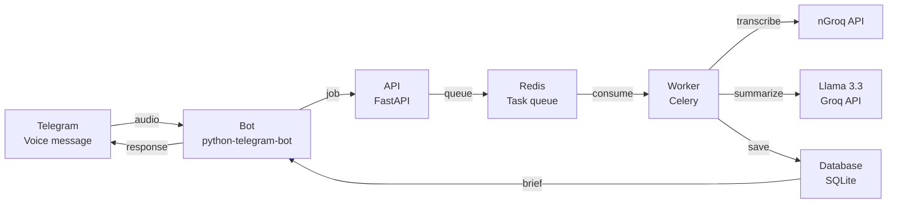

# Recall

Your AI teammate that listens, remembers, and helps you build.

Most ideas die because they never get captured properly. You talk 
to a mentor, have a breakthrough with a friend, or think of 
something in the shower — and by the time you sit down to build, 
half of it is gone. Recall fixes that.

Send a voice message on Telegram. Recall transcribes it, extracts 
what matters, and hands you back a structured brief with features, 
decisions, next steps, and blockers. It also challenges your 
thinking and generates context-aware prompts you can drop straight 
into any AI coding tool.

## Stack

- **Bot:** python-telegram-bot
- **Backend:** FastAPI + Celery + Redis
- **Transcription:** Groq Whisper API
- **AI:** Groq Llama 3.3 70B
- **Database:** SQLite + SQLAlchemy
- **Infrastructure:** Docker + Docker Compose

## Setup
```bash
cp .env.example .env
# Add your tokens — see Environment Variables below
docker-compose up --build
```

First run takes a few minutes. After that, just send a voice message.

## Commands

| Command | Description |
|---------|-------------|
| Voice message | Transcribe and generate a structured brief |
| /challenge | Probing questions that stress-test your latest idea |
| /prompt | Ask clarifying questions and generate a coding prompt |
| /history | Your 5 most recent briefs |
| /brainstorm | Feature ideas, pivots, and similar products |
| /summary | Weekly digest grouped by tags |
| /search {query} | Semantic search across your briefs |
| /evolution | Timeline of how ideas evolved across briefs |
| /ideas [tag] | List briefs filtered by tag |
| /add @{username} | Invite a collaborator to your session |
| /cancel | Cancel the /prompt conversation |
| /get {id} | Full details of a specific brief |

## Command Registration (BotFather)

Bot command buttons shown in the Telegram UI are populated via BotFather's `/setcommands`.

In BotFather:
1. Run `/setcommands`
2. Add the following commands (one per line):
   - `prompt - Ask questions and generate a coding prompt`
   - `brainstorm - Generate feature ideas and pivots`
   - `summary - Weekly digest grouped by tags`
   - `search - Semantic search across briefs`
   - `evolution - Timeline of how ideas evolved`
   - `ideas - List briefs filtered by tag`
   - `add - Invite a collaborator to your session`
   - `challenge - Probing questions on your latest brief`
   - `history - Your recent briefs`
   - `get - View full details for a prompt id`
   - `cancel - Cancel the /prompt flow`
3. Save/confirm.

Optional: you can also register commands programmatically after setting `TELEGRAM_BOT_TOKEN` by running:
```bash
python scripts/register_telegram_commands.py
```

## Environment Variables

| Variable | Description |
|----------|-------------|
| TELEGRAM_BOT_TOKEN | From @BotFather on Telegram |
| GROQ_API_KEY | From console.groq.com |
| API_TOKEN | Any random secret string for internal auth |
| REDIS_URL | Defaults to redis://redis:6379/0 |
| DATABASE_URL | Defaults to sqlite:///./data/recall.db |

## Architecture

The bot receives voice messages and forwards them to a FastAPI 
backend. Audio is transcribed via Groq Whisper, then passed to 
Llama 3.3 70B which extracts structured data and saves it to 
SQLite. Celery handles async processing with Redis as the broker, 
so the bot stays responsive while heavy work runs in the background.


